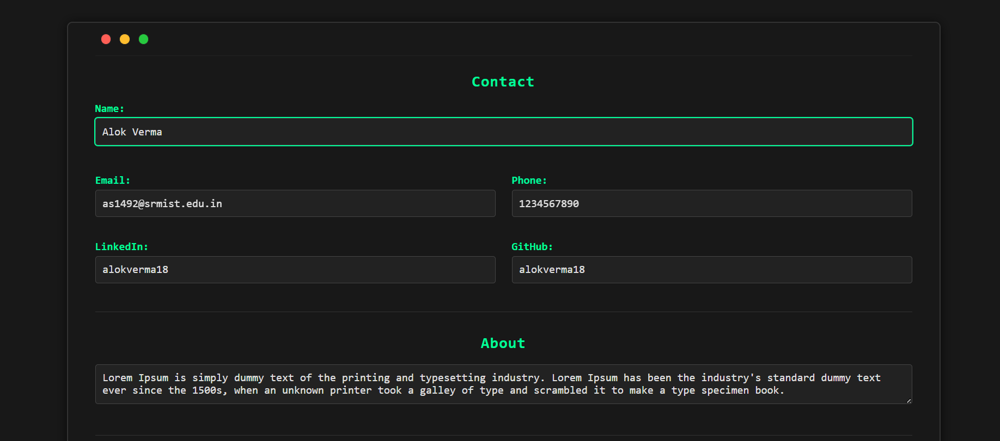
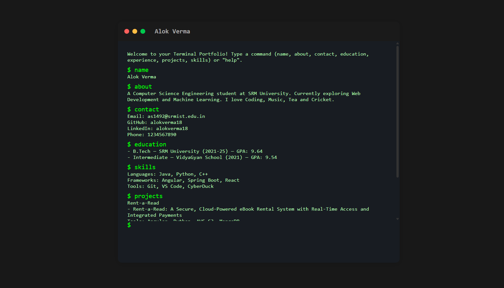

# Terminal Portfolio Generator

A sleek Angular application to create terminal-style portfolios. Users can input their resume data and preview it in a terminal interface.

## Features

- **Interactive Form**: Add and edit resume sections like education, experience, and projects.
- **Terminal Preview**: Realistic terminal UI with draggable interface and command support.
- **Export**: Generate a ready-to-deploy portfolio as HTML, CSS, and JS files.

## Snapshots
### Home

### Form 

### Preview

## Tech Stack

- Angular
- TypeScript
- CSS

---

*Built with simplicity and functionality in mind.*

---

## Contributing

Contributions are welcome! Feel free to fork the repository and submit pull requests. For major changes, please open an issue first to discuss what you would like to change.

## License

This project is licensed under the MIT License. See the LICENSE file for details.

---

**Built with ❤️ using Angular and AI assistance**
